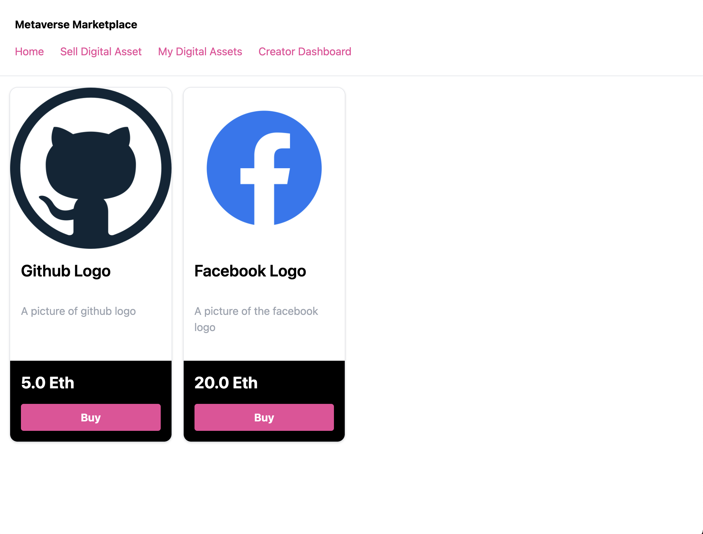

# Basic Sample NFT Marketplace Project

## Run locally

1. Install dependencies - `npm install`
2. Compile and deploy contracts to local blockchain - `npx hardhat run scripts/deploy.js --network localhost`
3. From output from step 2, copy and paste contract addresses into .config file
4. Start next.js app - `npm run dev`
5. Ensure your metamask wallet is connected to you local blockchain (probably on port 8545)
